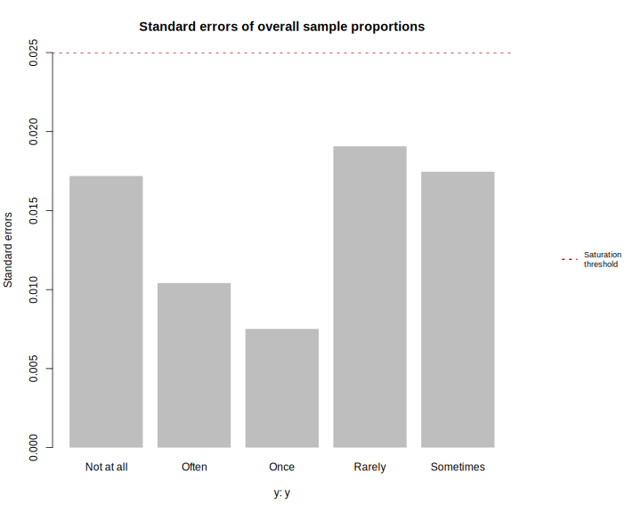
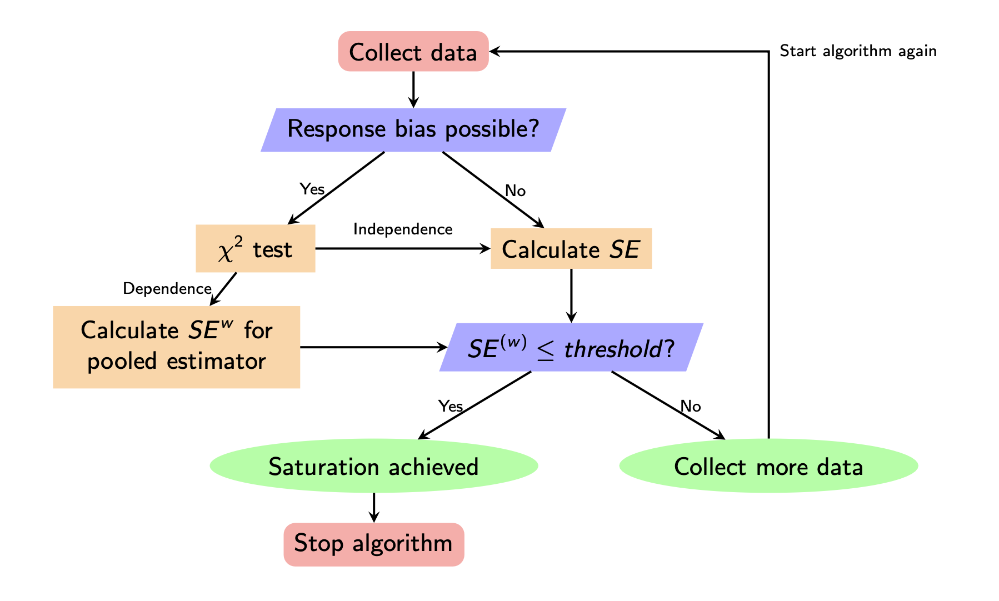

<!-- README.md is generated from README.Rmd. Please edit that file -->

# satpt

<!-- badges: start -->

[](https://github.com/deboonstra/satpt/actions/workflows/R-CMD-check.yaml)
<!-- badges: end -->

This *R* package identifies the saturation point of multinomial
responses from a survey using standard errors of sample proportions

## Installation

You can install the current released version of `satpt` from
[CRAN](https://cran.r-project.org) with

``` r
install.packages("satpt")
```

### Development version

To get a bug fix or to use a feature from the development version, you
can install the development version of `satpt` from
[GitHub](https://github.com/deboonstra/satpt).

``` r
# install.packages("remotes")
remotes::install_github("deboonstra/satpt")
```

## Usage

For basic usage of `satpt` simply specify the responses of the survey in
`y` and the data collection period information in `by`, as seen below.

``` r
library(satpt) # load package
data(ein) # load example ein data
res <- satpt::satpt(y = ein$q2, by = ein$wave)
print(res)
```

    #> Saturation achieved?  Yes 
    #> Overall Sample Proportions and Standard Errors
    #> ==============================================
    #>             y
    #> Statistics   Not at all   Once Rarely Sometimes  Often
    #>   Proportion     0.2531 0.0375 0.3688    0.2656 0.0750
    #>   SE             0.0172 0.0075 0.0191    0.0175 0.0104

Saturation of each individual response category may be examined
graphically while comparing the standard errors to the saturation
threshold.

``` r
graphics::par(oma = c(0, 0, 0, 8))
plot(res)
# adding legend
satpt::legend_right(
  legend = "Saturation\nthreshold",
  col = "firebrick", lty = 3, lwd = 2,
  cex = 0.75
)
```



# Methodology

Presented below is a simplified version of the algorithm that is
employed in `satpt` to determine whether saturation of the responses has
been achieved and whether pooled standard errors should be calculated to
account for response bias.


